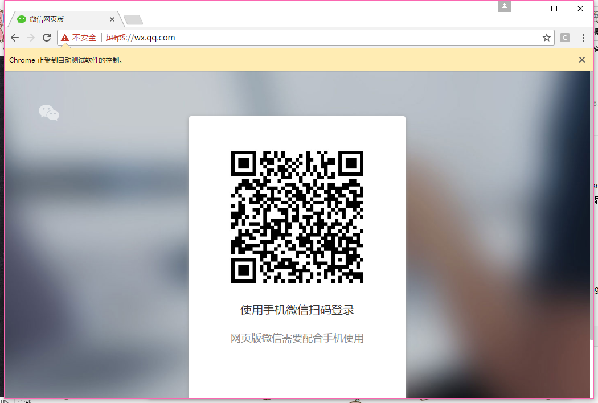
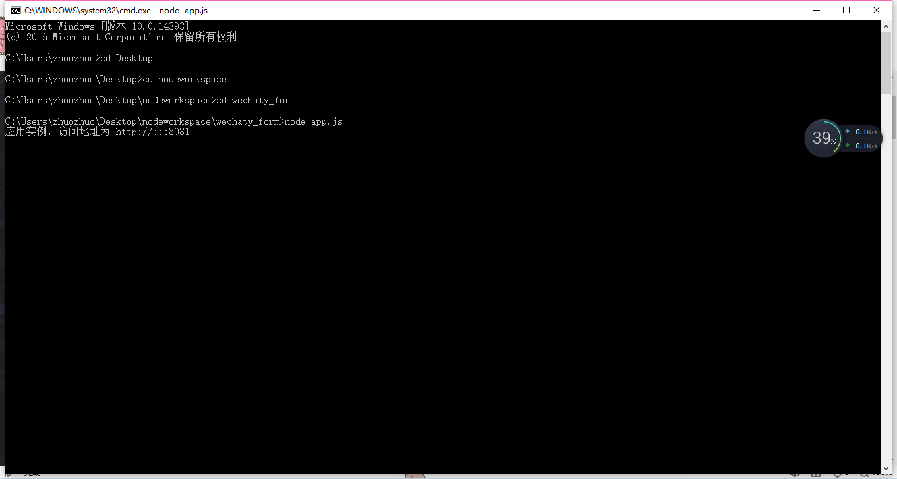
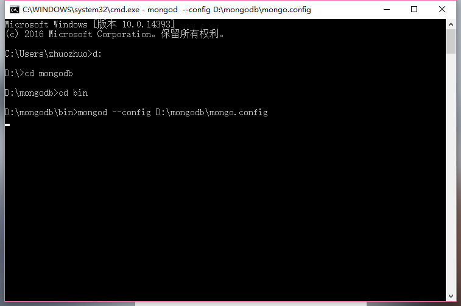
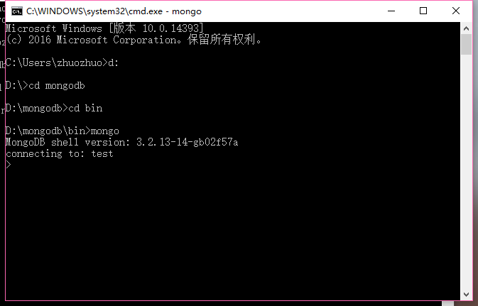
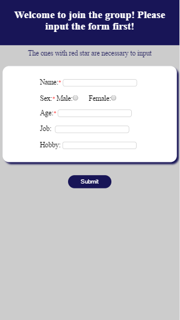

# wechaty_form
The program can help to invite person into a group.
If a member want to join into a room, it can send swim to the invitee and then it will receive am address to set down some information.
After the information can pass the check, the member can be invited into the group immediately.
Step:
start up wechaty: node myRoomForm.js
 
start up node: node app.js
 
start uo mongodb.
 
 
the information can be saved in the database.
 
user login by scan the qrcode.
One who redponses to check can get into the check.html to operate.
 
Click accept or not. If accept button was clicked, the member can be invited into the group.
 
 
